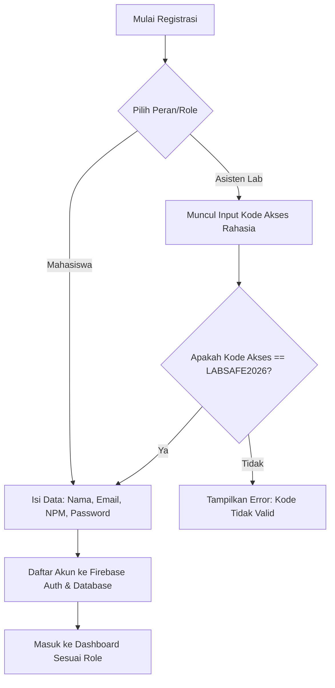

# Product Requirement Document (PRD)

## Nama Proyek: LabSafe
**Tagline**: *Aplikasi Pelaporan Aktivitas Mencurigakan dan Darurat di Laboratorium Komputer*

---

## 1. Latar Belakang & Masalah
Laboratorium komputer kampus adalah fasilitas bersama yang berisi aset penting dan rawan terhadap ancaman keamanan seperti pencurian hardware, akses tidak sah, kerusakan fasilitas, hingga bahaya kebakaran. 

Masalah utama yang diselesaikan oleh **LabSafe** adalah:
* **Keterlambatan Pelaporan**: Mahasiswa sering kali bingung harus menghubungi siapa ketika melihat tindakan mencurigakan atau situasi darurat di lab.
* **Keterbatasan Pemantauan Asisten**: Asisten laboratorium tidak bisa terus-menerus berada di lab untuk memantau keadaan secara langsung.
* **Informasi Lokasi Tidak Akurat**: Pelaporan manual sering kali tidak menyertakan koordinat lokasi yang presisi di lingkungan kampus.

---

## 2. Tujuan Produk
Menyediakan aplikasi mobile berbasis Flutter yang memungkinkan:
1. Mahasiswa untuk mengirim laporan darurat secara cepat dan instan melalui guncangan perangkat (*shake detection*), pengambilan foto bukti, dan pelacakan GPS aktif.
2. Asisten laboratorium untuk menerima notifikasi instan secara real-time dan menindaklanjuti laporan tersebut secara cepat guna meminimalkan risiko kerusakan atau kehilangan.

---

## 3. Profil Pengguna (User Personas)

### A. Mahasiswa (Reporter)
* **Tujuan**: Melaporkan kejadian mencurigakan atau darurat dengan cepat tanpa birokrasi yang rumit.
* **Fitur Utama**:
  * Registrasi & Login mandiri.
  * Fitur guncang HP (*shake to report*) untuk aksi cepat.
  * Fitur kamera untuk bukti foto.
  * Deteksi otomatis lokasi GPS sensor aktif.
  * Pemantauan status laporan pribadinya ("Laporan Terkirim" & "Laporan Sudah Ditindaklanjuti").

### B. Asisten Laboratorium (Officer)
* **Tujuan**: Memantau seluruh lab dan menindaklanjuti laporan mahasiswa secara real-time.
* **Fitur Utama**:
  * Registrasi aman dengan Kode Akses Rahasia (`LABSAFE2026`).
  * Dashboard khusus asisten (tanpa tombol laporan/darurat).
  * Notifikasi push lokal yang langsung berbunyi di HP ketika ada laporan masuk baru.
  * Tombol aksi cepat "Tindak Lanjuti Laporan" untuk mengubah status laporan secara real-time.

---

## 4. Alur Kerja Aplikasi (Workflow)

### A. Registrasi Keamanan (Role-Based)

### B. Penyederhanaan Alur Status Laporan
Status laporan disederhanakan hanya menjadi **dua kondisi** untuk mempercepat penanganan tanpa tahap perantara:

| Kondisi Database | Tampilan Sisi Mahasiswa | Tampilan Sisi Asisten Lab |
| :--- | :--- | :--- |
| **`Terkirim`** (Awal) | Laporan Terkirim | Laporan Diterima |
| **`Ditindaklanjuti`** (Akhir) | Laporan Sudah Ditindaklanjuti | Laporan Ditindak Lanjut |

---

## 5. Fitur Utama & Kebutuhan Fungsional

### F-01: Autentikasi & Registrasi Rahasia
* Pengguna dapat mendaftar dan login menggunakan email kampus.
* Pilihan role: `mahasiswa` dan `asisten`.
* Khusus role `asisten`, wajib memasukkan kode akses `LABSAFE2026`. Jika tidak cocok, sistem menolak registrasi.
* Pengguna dapat melakukan reset password melalui email jika lupa password.

### F-02: Shake to Report (Guncang HP)
* Memanfaatkan sensor akselerometer & giroskop perangkat.
* Guncangan HP sebanyak 2-3 kali secara beruntun akan langsung mengalihkan pengguna ke layar deteksi darurat.
* Dilengkapi dengan hitung mundur (*countdown*) 5 detik sebelum otomatis lanjut ke proses pengambilan foto. Pengguna dapat menekan "Batal" jika tidak sengaja mengguncang HP.

### F-03: Kamera Bukti
* Setelah guncangan dikonfirmasi, aplikasi otomatis membuka kamera untuk mengambil foto bukti di tempat kejadian.
* Gambar dikompresi dan dikonversi menjadi string **Base64** sebelum dikirim ke Firebase Realtime Database guna efisiensi penyimpanan tanpa media bucket tambahan.

### F-04: Deteksi Lokasi GPS Aktif
* Mengintegrasikan package `geolocator` untuk mendapatkan koordinat garis lintang (*latitude*) dan bujur (*longitude*) asli dari sensor GPS perangkat.
* Sistem memblokir data tiruan (dummy/mock) guna menjamin validitas lokasi kejadian.
* Menampilkan estimasi nama lab komputer terdekat berdasarkan database koordinat lab kampus.

### F-05: Real-Time Notifications untuk Asisten
* Ketika mahasiswa berhasil mengirim laporan, sistem menyimpan entri notifikasi baru di database dengan flag `read: false`.
* Aplikasi asisten laboratorium yang sedang aktif mendengarkan stream database tersebut secara langsung.
* Begitu entri notifikasi baru terdeteksi, HP asisten akan memicu notifikasi sistem lokal menggunakan `flutter_local_notifications` sehingga asisten langsung siaga meskipun sedang membuka menu lain.

---

## 6. Kebutuhan Non-Fungsional (Non-Functional Requirements)

* **Keamanan**: Kredensial asisten bersifat rahasia dan divalidasi langsung saat registrasi.
* **Performa**: Konversi Base64 untuk foto dikompresi agar ukuran data tidak membebani performa pembacaan Realtime Database.
* **Offline Resiliency**: Terdapat penanganan error yang ramah pengguna apabila koneksi internet terputus saat pengiriman laporan.

---

## 7. Teknologi Yang Digunakan (Tech Stack)

* **Bahasa**: Dart (Flutter SDK)
* **State Management**: Provider (untuk sinkronisasi auth dan laporan secara dinamis)
* **Backend & Database**: 
  * Firebase Auth (Manajemen Pengguna)
  * Firebase Realtime Database Singapore Region (`asia-southeast1`)
* **Library Utama**:
  * `sensors_plus` (Deteksi Guncangan)
  * `geolocator` (Akses GPS Sensor Aktif)
  * `image_picker` (Akses Kamera Perangkat)
  * `flutter_local_notifications` (Notifikasi Status Bar Sistem)
